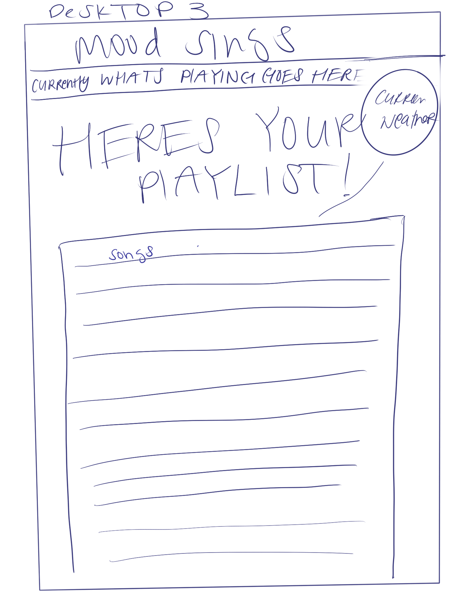

# moodSing 
moodSing is a weather app that uses the user's current location to determine weather conditions then play music to fit the current weather. The user can also input their current mood and the site will play music according to their mood. These features bypass the need for users to explain their mood as well as introducing new genres of music to users. 

## Roles

```
Front End 
    - Katie Dickson 
    - Ismahan Jamea
```
```
Back End 
    - Jacob Cowan
    - Andrew Crow
    - Robert Dalton
```

-------------------
## Visuals

Initial Desktop Wireframe


After User Input Desktop Wireframe


Initial Mobile Wireframe


After User Input Mobile Wireframe


Weather to Mood Index


## API's

Weather:
api.weather.gov

Music Content/Playlist and info:
Spotify Wev API

Location info (lat/long):
https://developer.mozilla.org/en-US/docs/Web/API/Geolocation_API
